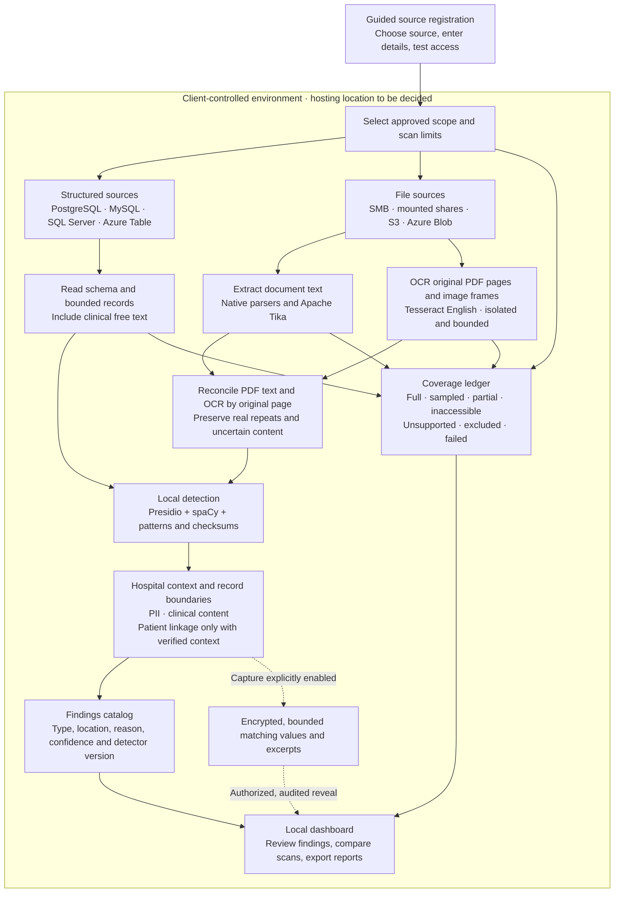

# Discovery flow

The application runs in a client-controlled Linux environment. The hospital has
not yet selected on-premises or private-cloud hosting. Source connections must use
approved private routes and read-only accounts.

- In-house applications hosted on private AWS are reached through their approved
  database or storage connector; hosting on AWS does not establish the database
  engine or create an application-specific API connector.
- No generative LLM, external inference service or OpenMetadata is required by
  this implementation. Presidio and spaCy run locally.
- Page/frame OCR completion is tracked separately from recognition accuracy.
  Native-bearing PDFs and Office/Tika-only results retain partial coverage.
  Only eligible blank or raw-pixel image-only PDFs can reach full processing
  coverage after native-text, geometry, ancillary-content and OCR checks pass.
- Exact-value evaluation counts occurrences within each source object. Version 3
  also evaluates clinical presence and exact patient-reference association in
  supported original JSON/text records, typed-key SQLite reference exports and
  independently annotated original PDF-page/raster-frame rectangles. Unvalidated
  document geometry, Office association mappings and semantic diagnosis evaluation
  remain unsupported. Hospital accuracy and workload acceptance are not established.
- Repeated-scan finding deltas require comparable complete reads and matching
  detector, policy and processing runtime. Lost coverage never proves removal.

See [the supported-format matrix](supported-formats.md),
[pilot completion audit](pilot-status.md) and [runbook](runbook.md).
